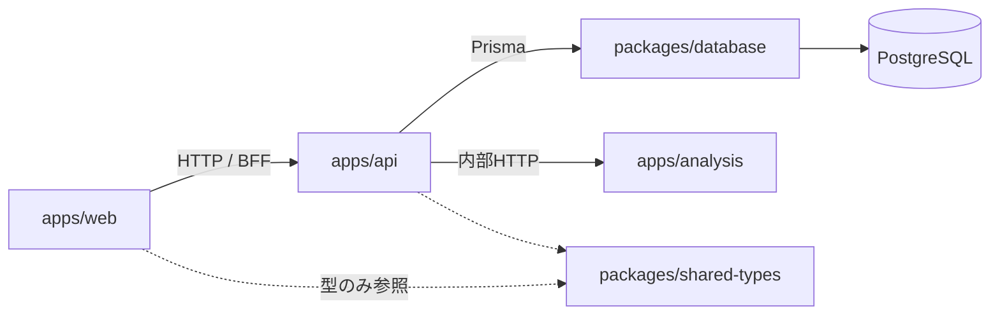

# アーキテクチャ概要

market-platform のディレクトリ構成、責務分離、Turborepo / pnpm / Docker Compose の設計です。

## システム概要

株式・ETF・指数などの市場データを取得し、テクニカル分析や売買シグナル、バックテストなどを提供する Web システムです。自動売買は対象外です。

将来的には次の機能を追加予定です。

- 株価取得
- ウォッチリスト
- ポートフォリオ管理
- テクニカル分析
- 売買シグナル
- バックテスト
- 通知
- AI 分析

## 開発方針

- TypeScript を Web アプリケーションの中心とする
- Python は株価分析・テクニカル分析・バックテスト・AI 分析専用とする
- フロントエンドは Next.js（React + TypeScript）
- Web API は NestJS
- 分析 API は FastAPI
- データベースは PostgreSQL、ORM は Prisma
- Docker Compose で全体を起動できる構成にする
- モノレポ構成（pnpm Workspace + Turborepo）
- 将来的なマイクロサービス化を考慮した責務分離
- 保守性・拡張性・テスト容易性を重視する
- 必要以上にライブラリを追加しない

## ディレクトリ構成

```
market-platform/
├── apps/
│   ├── web/                 # Next.js (React + TypeScript)
│   ├── api/                 # NestJS Web API
│   └── analysis/            # FastAPI (分析専用)
├── packages/
│   ├── database/            # Prisma schema / client
│   ├── shared-types/        # TS 共有型・DTO（API 契約）
│   └── shared-config/       # tsconfig / ESLint / Prettier 基底
├── docs/
│   ├── README.md
│   ├── architecture/
│   ├── adr/                 # Architecture Decision Records（フラット連番）
│   ├── roadmap/             # バージョン別ロードマップ（vX/vX.Y/vX.Y.Z.md）
│   └── roadmap.md           # 現行版への案内スタブ
├── docker/
│   ├── Dockerfile.web
│   ├── Dockerfile.api
│   └── Dockerfile.analysis
├── scripts/
├── docker-compose.yml
├── package.json
├── pnpm-workspace.yaml
├── turbo.json
└── README.md
```

### 初期案からの改善点

| 追加 | 理由 |
|------|------|
| `packages/database` | Prisma を NestJS 内に閉じ込めず、マイグレーション責務を独立させる。将来の worker / BFF でも同一 Client を再利用しやすい |
| `docs/adr/` | 「なぜこの境界か」を残し、マイクロサービス化時の判断根拠にする（認証は ADR 001、市場データは ADR 002） |
| Compose はルート `docker-compose.yml` + `docker/Dockerfile.*` | 開発時の `docker compose up` が最短 |

## 各ディレクトリの責務



| パス | 責務 |
|------|------|
| `apps/web` | UI・認証画面・データ表示。ビジネスロジックや DB 直接アクセスは持たない。NestJS API のみを呼ぶ |
| `apps/api` | ドメイン API（ウォッチリスト、ポートフォリオ、マスタ、通知設定など）。PostgreSQL は Prisma 経由。分析処理は FastAPI に委譲 |
| `apps/analysis` | テクニカル分析・シグナル・バックテスト・AI 分析。Python 専用。原則 DB 書き込みは NestJS 側に寄せ、分析結果は API レスポンスまたは NestJS 経由で永続化する |
| `packages/database` | `schema.prisma`、マイグレーション、生成 Client。NestJS が依存する |
| `packages/shared-types` | TypeScript 間の API 契約・共有型。Python とは OpenAPI / 明示的な JSON スキーマで同期する（無理に型共有しない） |
| `packages/shared-config` | 共有 `tsconfig`、ESLint、Prettier 設定。アプリ実装は持たない |
| `docs/` | アーキテクチャ、ADR、ロードマップなど設計の正本。認証は [ADR 001](../adr/001-authentication-jwt.md)、市場データは [ADR 002](../adr/002-market-data-provider.md)、ウォッチリスト/ポートフォリオは [ADR 003](../adr/003-watchlist-portfolio.md)、テクニカル分析は [ADR 004](../adr/004-technical-analysis.md) |
| `docker/` | 各アプリの Dockerfile |
| `scripts/` | ローカル初期化、DB 待機などの開発用ユーティリティ（アプリロジックは置かない） |

## Turborepo 構成

ルート `turbo.json` の想定タスク:

```json
{
  "$schema": "https://turbo.build/schema.json",
  "tasks": {
    "build": {
      "dependsOn": ["^build"],
      "outputs": ["dist/**", ".next/**", "!.next/cache/**"]
    },
    "dev": {
      "cache": false,
      "persistent": true
    },
    "lint": {
      "dependsOn": ["^build"]
    },
    "test": {
      "dependsOn": ["^build"]
    },
    "typecheck": {
      "dependsOn": ["^build"]
    },
    "generate": {
      "cache": false
    }
  }
}
```

- `generate`: Prisma Client 生成（`packages/database`）
- `dev`: web / api は turbo。analysis は薄いラッパー（`pnpm --filter analysis dev` → `uvicorn`）を置き、キャッシュ対象外とする
- パッケージ名例: `@market/web`, `@market/api`, `@market/analysis`, `@market/database`, `@market/shared-types`, `@market/shared-config`

## pnpm Workspace 構成

`pnpm-workspace.yaml`:

```yaml
packages:
  - "apps/*"
  - "packages/*"
```

ルート `package.json` の想定スクリプト:

- `dev` / `build` / `lint` / `test` / `typecheck` → `turbo run ...`
- `db:generate` / `db:migrate` / `db:studio` → `@market/database` 経由
- `packageManager`: `pnpm@9.x`（導入時点の LTS 相当を固定）

依存の向き:

- `web` → `shared-types`, `shared-config`
- `api` → `database`, `shared-types`, `shared-config`
- `analysis` → Node パッケージに依存しない（Python は `apps/analysis/pyproject.toml` + **uv**）
- `database` → Prisma のみ（アプリコードなし）

## Docker Compose 構成

最小サービス構成:

| サービス | 役割 | 公開ポート（開発） |
|----------|------|-------------------|
| `postgres` | PostgreSQL 16 | `5432` |
| `api` | NestJS | `3001` |
| `web` | Next.js | `3000` |
| `analysis` | FastAPI | `8000` |

通信:

- `web` → `http://api:3001`
- `api` → `http://analysis:8000`（内部ネットワーク）
- `api` → `postgres:5432`（`DATABASE_URL`）

ボリューム: `postgres_data` のみ必須。Redis / キューは必要になるまで追加しない。

環境変数はルート `.env.example` を置き、実ファイルは gitignore する。

## 設定ファイル一覧

### 整備済み（初期 + Phase 0 + Phase 1）

| ファイル | 内容 |
|----------|------|
| `.editorconfig` | TS/Python 共通のインデント・LF |
| `.gitattributes` | LF 強制・バイナリ定義 |
| `.prettierignore` | 生成物・venv 除外 |
| `.gitignore` | モノレポ向け ignore |
| `package.json` / `pnpm-workspace.yaml` / `turbo.json` | モノレポ基盤 |
| `prettier.config.mjs` / `.nvmrc` / `.env.example` | 開発設定（JWT 含む） |
| `docker-compose.yml` / `docker/Dockerfile.*` | コンテナ構成 |
| `packages/shared-config` | 共有 `tsconfig.base.json` |
| `packages/database` | Prisma 7 schema / config / Client（User / Symbol / DailyPrice / Watchlist / Portfolio） |
| `packages/shared-types` | Health / ApiErrorBody / Auth / Market / Watchlist / Portfolio / Analysis DTO |
| `apps/analysis/pyproject.toml` | FastAPI + uv（Docker）/ pip 可 |
| `.github/workflows/ci.yml` | lint / typecheck / test |

### 基盤（Phase 1）

- **認証**: JWT + メール/パスワード（[ADR 001](../adr/001-authentication-jwt.md)）
- **共通エラー**: `ApiErrorBody`（NestJS / FastAPI で同形）
- **OpenAPI**: NestJS `/docs`、FastAPI `/docs`
- **ロギング**: リクエスト単位の method / path / status / duration

### 市場データ（Phase 2）

- **銘柄マスタ / 日足**: Prisma `Symbol` / `DailyPrice`（US・JP）
- **取得**: `MarketDataProvider` 抽象 + Yahoo / Stub（[ADR 002](../adr/002-market-data-provider.md)）
- **ジョブ**: `@nestjs/schedule` 日次 cron + `POST /market-data/jobs/sync-prices`
- **API**: `GET|POST|PATCH /symbols`、`GET /symbols/:id/prices`

### ウォッチリスト / ポートフォリオ（Phase 3）

- **ウォッチリスト**: ユーザー所有の複数名前付きリスト + 銘柄参照（`Watchlist` / `WatchlistItem`）
- **ポートフォリオ**: 複数名前付き + 保有（`quantity` / `averageCost`）。評価は最新日足終値、集計は通貨別（[ADR 003](../adr/003-watchlist-portfolio.md)）
- **API**: `GET|POST|PATCH|DELETE /watchlists`、`POST|DELETE /watchlists/:id/items`、`GET|POST|PATCH|DELETE /portfolios`、`POST|PATCH|DELETE /portfolios/:id/holdings`
- **Web**: `/watchlists`、`/portfolios`

### テクニカル分析（Phase 4）

- **計算**: FastAPI `POST /indicators`（SMA / EMA / RSI / MACD。pandas + numpy 自前実装）
- **ゲートウェイ**: NestJS が日足を lookback 付きで読み、analysis に委譲して返却（結果は永続化しない）
- **公開 API**: `GET /symbols/:id/indicators`（JWT。[ADR 004](../adr/004-technical-analysis.md)）

### 後続で追加予定

- ESLint flat config（shared-config への集約）
- `.vscode/extensions.json`（Prisma, ESLint, Prettier, Python）

ESLint 本体は必要になったタイミングで最小構成で入れる。

## 関連ドキュメント

- [ドキュメント索引](../README.md)
- [開発ロードマップ](../roadmap/README.md)（現行: [v0.1.0](../roadmap/v0/v0.1/v0.1.0.md)）
- [ADR 001: JWT 認証](../adr/001-authentication-jwt.md)
- [ADR 002: 市場データプロバイダ](../adr/002-market-data-provider.md)
- [ADR 003: ウォッチリスト / ポートフォリオ](../adr/003-watchlist-portfolio.md)
- [ADR 004: テクニカル分析](../adr/004-technical-analysis.md)
