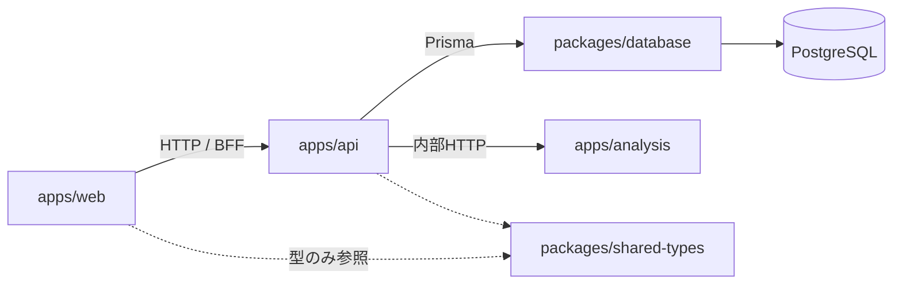

# アーキテクチャ概要

market-platform のディレクトリ構成、責務分離、Turborepo / pnpm / Docker Compose の設計です。

## システム概要

株式・ETF・指数などの市場データを取得し、テクニカル分析や売買シグナル、バックテストなどを提供する Web システムです。自動売買は対象外です。

将来的には次の機能を追加予定です。

- 株価取得
- ウォッチリスト
- ポートフォリオ管理
- テクニカル分析
- 売買シグナル
- バックテスト
- 通知
- AI 分析

## 開発方針

- TypeScript を Web アプリケーションの中心とする
- Python は株価分析・テクニカル分析・バックテスト・AI 分析専用とする
- フロントエンドは Next.js（React + TypeScript）
- Web API は NestJS
- 分析 API は FastAPI
- データベースは PostgreSQL、ORM は Prisma
- Docker Compose で全体を起動できる構成にする
- モノレポ構成（pnpm Workspace + Turborepo）
- 将来的なマイクロサービス化を考慮した責務分離
- 保守性・拡張性・テスト容易性を重視する
- 必要以上にライブラリを追加しない

## ディレクトリ構成

```
market-platform/
├── apps/
│   ├── web/                 # Next.js (React + TypeScript)
│   ├── api/                 # NestJS Web API
│   └── analysis/            # FastAPI (分析専用)
├── packages/
│   ├── database/            # Prisma schema / client
│   ├── shared-types/        # TS 共有型・DTO（API 契約）
│   └── shared-config/       # tsconfig / ESLint / Prettier 基底
├── docs/
│   ├── README.md
│   ├── architecture/
│   ├── adr/                 # Architecture Decision Records（フラット連番）
│   ├── roadmap/             # バージョン別ロードマップ（vX/vX.Y/vX.Y.Z.md）
│   └── roadmap.md           # 現行版への案内スタブ
├── docker/
│   ├── Dockerfile.web
│   ├── Dockerfile.api
│   └── Dockerfile.analysis
├── scripts/
├── docker-compose.yml
├── package.json
├── pnpm-workspace.yaml
├── turbo.json
└── README.md
```

### 初期案からの改善点

| 追加                                                          | 理由                                                                                                                    |
| ------------------------------------------------------------- | ----------------------------------------------------------------------------------------------------------------------- |
| `packages/database`                                           | Prisma を NestJS 内に閉じ込めず、マイグレーション責務を独立させる。将来の worker / BFF でも同一 Client を再利用しやすい |
| `docs/adr/`                                                   | 「なぜこの境界か」を残し、マイクロサービス化時の判断根拠にする（認証は ADR 001、市場データは ADR 002）                  |
| Compose はルート `docker-compose.yml` + `docker/Dockerfile.*` | 開発時の `docker compose up` が最短                                                                                     |

## 各ディレクトリの責務



| パス                     | 責務                                                                                                                                                                                                                                                                                                        |
| ------------------------ | ----------------------------------------------------------------------------------------------------------------------------------------------------------------------------------------------------------------------------------------------------------------------------------------------------------- |
| `apps/web`               | UI・認証画面・データ表示。ビジネスロジックや DB 直接アクセスは持たない。NestJS API のみを呼ぶ                                                                                                                                                                                                               |
| `apps/api`               | ドメイン API（ウォッチリスト、ポートフォリオ、マスタ、通知設定など）。PostgreSQL は Prisma 経由。分析処理は FastAPI に委譲                                                                                                                                                                                  |
| `apps/analysis`          | テクニカル分析・シグナル・バックテスト・AI 分析。Python 専用。原則 DB 書き込みは NestJS 側に寄せ、分析結果は API レスポンスまたは NestJS 経由で永続化する                                                                                                                                                   |
| `packages/database`      | `schema.prisma`、マイグレーション、生成 Client。NestJS が依存する                                                                                                                                                                                                                                           |
| `packages/shared-types`  | TypeScript 間の API 契約・共有型。Python とは OpenAPI / 明示的な JSON スキーマで同期する（無理に型共有しない）                                                                                                                                                                                              |
| `packages/shared-config` | 共有 `tsconfig`、ESLint、Prettier 設定。アプリ実装は持たない                                                                                                                                                                                                                                                |
| `docs/`                  | アーキテクチャ、ADR、ロードマップなど設計の正本。認証は [ADR 001](../adr/001-authentication-jwt.md)、市場データは [ADR 002](../adr/002-market-data-provider.md)、ウォッチリスト/ポートフォリオは [ADR 003](../adr/003-watchlist-portfolio.md)、テクニカル分析は [ADR 004](../adr/004-technical-analysis.md)、指標カタログは [ADR 006](../adr/006-indicator-catalog.md)、トレンドスコアは [ADR 007](../adr/007-trend-score.md)、指標セットは [ADR 008](../adr/008-indicator-sets.md) |
| `docker/`                | 各アプリの Dockerfile                                                                                                                                                                                                                                                                                       |
| `scripts/`               | ローカル初期化、DB 待機などの開発用ユーティリティ（アプリロジックは置かない）                                                                                                                                                                                                                               |

## Turborepo 構成

ルート `turbo.json` の想定タスク:

```json
{
  "$schema": "https://turbo.build/schema.json",
  "tasks": {
    "build": {
      "dependsOn": ["^build"],
      "outputs": ["dist/**", ".next/**", "!.next/cache/**"]
    },
    "dev": {
      "cache": false,
      "persistent": true
    },
    "lint": {
      "dependsOn": ["^build"]
    },
    "test": {
      "dependsOn": ["^build"]
    },
    "typecheck": {
      "dependsOn": ["^build"]
    },
    "generate": {
      "cache": false
    }
  }
}
```

- `generate`: Prisma Client 生成（`packages/database`）
- `dev`: web / api は turbo。analysis は薄いラッパー（`pnpm --filter analysis dev` → `uvicorn`）を置き、キャッシュ対象外とする
- パッケージ名例: `@market/web`, `@market/api`, `@market/analysis`, `@market/database`, `@market/shared-types`, `@market/shared-config`

## pnpm Workspace 構成

`pnpm-workspace.yaml`:

```yaml
packages:
  - 'apps/*'
  - 'packages/*'
```

ルート `package.json` の想定スクリプト:

- `dev` / `build` / `lint` / `test` / `typecheck` → `turbo run ...`
- `db:generate` / `db:migrate` / `db:studio` → `@market/database` 経由
- `packageManager`: `pnpm@9.x`（導入時点の LTS 相当を固定）

依存の向き:

- `web` → `shared-types`, `shared-config`
- `api` → `database`, `shared-types`, `shared-config`
- `analysis` → Node パッケージに依存しない（Python は `apps/analysis/pyproject.toml` + **uv**）
- `database` → Prisma のみ（アプリコードなし）

## Docker Compose 構成

最小サービス構成:

| サービス   | 役割          | 公開ポート（開発） |
| ---------- | ------------- | ------------------ |
| `postgres` | PostgreSQL 16 | `5432`             |
| `api`      | NestJS        | `3001`             |
| `web`      | Next.js       | `3000`             |
| `analysis` | FastAPI       | `8000`             |

通信:

- `web` → `http://api:3001`
- `api` → `http://analysis:8000`（内部ネットワーク）
- `api` → `postgres:5432`（`DATABASE_URL`）

ボリューム: `postgres_data` のみ必須。Redis / キューは必要になるまで追加しない。

環境変数はルート `.env.example` を置き、実ファイルは gitignore する。

## 設定ファイル一覧

### 整備済み（初期 + Phase 0 + Phase 1）

| ファイル                                              | 内容                                                                                    |
| ----------------------------------------------------- | --------------------------------------------------------------------------------------- |
| `.editorconfig`                                       | TS/Python 共通のインデント・LF                                                          |
| `.gitattributes`                                      | LF 強制・バイナリ定義                                                                   |
| `.prettierignore`                                     | 生成物・venv 除外                                                                       |
| `.gitignore`                                          | モノレポ向け ignore                                                                     |
| `package.json` / `pnpm-workspace.yaml` / `turbo.json` | モノレポ基盤（製品バージョン正本はルート `package.json` の `version`）                  |
| `prettier.config.mjs` / `.nvmrc` / `.env.example`     | 開発設定（JWT 含む）                                                                    |
| `docker-compose.yml` / `docker/Dockerfile.*`          | コンテナ構成                                                                            |
| `packages/shared-config`                              | 共有 `tsconfig.base.json`                                                               |
| `packages/database`                                   | Prisma 7 schema / config / Client（User / Symbol / DailyPrice / Watchlist / Portfolio / IndicatorSet） |
| `packages/shared-types`                               | Health / ApiErrorBody / Auth / Market / Watchlist / Portfolio / Analysis / IndicatorSet DTO            |
| `apps/analysis/pyproject.toml`                        | FastAPI + uv（Docker）/ pip 可                                                          |
| `.github/workflows/ci.yml`                            | lint / typecheck / test                                                                 |

### 基盤（Phase 1）

- **認証**: JWT + メール/パスワード（[ADR 001](../adr/001-authentication-jwt.md)）
- **共通エラー**: `ApiErrorBody`（NestJS / FastAPI で同形）
- **OpenAPI**: NestJS `/docs`、FastAPI `/docs`
- **ロギング**: リクエスト単位の method / path / status / duration

### 市場データ（Phase 2）

- **銘柄マスタ / 日足**: Prisma `Symbol` / `DailyPrice`（US・JP）
- **取得**: `MarketDataProvider` 抽象 + Yahoo / Stub（[ADR 002](../adr/002-market-data-provider.md)）
- **ジョブ**: `@nestjs/schedule` 日次 cron + `POST /market-data/jobs/sync-prices`
- **API**: `GET|POST|PATCH /symbols`、`GET /symbols/:id/prices`
- **差分同期（v0.2.0）**: 保存済み min より前・max より後のみ取得。期間付き GET でも不足期間を補完

### ウォッチリスト / ポートフォリオ（Phase 3）

- **ウォッチリスト**: ユーザー所有の複数名前付きリスト + 銘柄参照（`Watchlist` / `WatchlistItem`）
- **ポートフォリオ**: 複数名前付き + 保有（`quantity` / `averageCost`）。評価は最新日足終値、集計は通貨別（[ADR 003](../adr/003-watchlist-portfolio.md)）
- **API**: `GET|POST|PATCH|DELETE /watchlists`、`POST|DELETE /watchlists/:id/items`、`GET|POST|PATCH|DELETE /portfolios`、`POST|PATCH|DELETE /portfolios/:id/holdings`
- **Web**: `/watchlists`、`/portfolios`

### テクニカル分析（v0.1 Phase 4 / v0.2.0 Phase 3〜5）

- **計算**: FastAPI `POST /indicators`（pandas + numpy 自前実装。結果は永続化しない）
- **カタログ**: 分類付き ID（SMA 25/75/200、MACD、RSI、ボリンジャー、一目、OBV など）。時系列は `values`、フィボナッチ / Volume Profile は `drawings`（[ADR 006](../adr/006-indicator-catalog.md)）
- **トレンドスコア**: FastAPI `POST /trend-score`。指標を 1 グループに固定して -100〜+100 を合成し、チャート背景に使う（[ADR 007](../adr/007-trend-score.md)）
- **ゲートウェイ**: NestJS が日足を lookback 付きで読み、analysis に委譲して返却
- **公開 API**: `GET /symbols/:id/indicators`、`GET /symbols/:id/trend-score`（JWT。[ADR 004](../adr/004-technical-analysis.md)）
- **Web**: `/charts` はチャートを本画面に表示し、指標・セット呼び出し・スコア内訳は各ボタン＋画面共通の希望表示ラジオ（モードレス／別ウィンドウ）。拡大は全画面の別ウィンドウ（[ADR 005](../adr/005-chart-analysis.md)）
- **指標セット（v0.2.0 / Phase 5）**: ユーザー所有の名前付きトグル集合。`GET|POST|DELETE /indicator-sets`。保存は指標設定ウィンドウ内、呼び出しは独立ウィンドウ（[ADR 008](../adr/008-indicator-sets.md)）

### 認証 UX（v0.2.0 / Phase 1）

- **未ログイン**: `/login`・`/register` 以外は `/login` へ誘導する（トップ `/` を含む）
- **ログイン後**: 共通ヘッダーに機能メニューとログアウトを置く。ログイン／登録リンクは認証画面同士のみ
- **方式**: JWT は [ADR 001](../adr/001-authentication-jwt.md) のまま（localStorage + Bearer）。httpOnly Cookie は対象外

### 銘柄追加（v0.2.0 / Phase 2）

- **入力**: ティッカー + 市場（US/JP）。名称・通貨・取引所は Yahoo / Stub の `fetchQuote`
- **Web**: `/symbols`（共通ヘッダーの「銘柄」）
- **日足**: `DailyPrice` の最小日より前・最大日より後だけ取得（[ADR 002](../adr/002-market-data-provider.md)）

### Web 画面構成（v0.3.0 / Ph1）

ログイン後の各画面はヘッダーナビに加え、画面上部に役割説明（リード文）を置く。ナビの「バックテスト」は `/backtests`。指標設定は `/charts`。

| パス | 役割 |
| ---- | ---- |
| `/` | 各機能への入口。API health の確認 |
| `/symbols` | 銘柄マスタの追加・一覧 |
| `/watchlists` | 注目銘柄リストの管理 |
| `/portfolios` | 保有の登録・集計 |
| `/backtests` | 指標セット選択とバックテスト実行・結果 |
| `/charts` | チャート分析（指標設定・スコア）。シグナル導出の設定場所 |
| `/me` | ログイン中アカウントの確認 |

画面間連携はクエリで行う（`apps/web/lib/app-routes.ts`）:

- `/charts?symbolId=&watchlistId=&from=&to=` — 銘柄・WL・期間を初期選択
- `/backtests?indicatorSetId=` — チャートで保存した指標セットを初期選択
- 銘柄ゼロ時は各画面から `/symbols` へ「銘柄を追加」導線

### シグナル / バックテスト検証 UX（v0.3.0 / Ph2）

- **Web** `/backtests`: 開始資金、結果選択、サマリーカード、AnalysisChart（売買マーカー）、エクイティ（戦略 + Buy&Hold）、取引履歴
- **Analysis**: 拡張サマリー（Sharpe / Profit Factor / Buy&Hold）
- **Nest**: 拡張列の永続化
- 詳細は [ADR 009](../adr/009-backtest-enrichment.md)

### 指標セット起点のシグナルと画面分離（v0.3.0 / Ph3）

- **Web** `/charts`: 指標 ON/OFF・セット保存／呼び出し・シグナル導出プレビュー・バックテスト導線
- **Web** `/backtests`: 指標セット選択・実行・結果・カタログ SMA ペア最適化（戦略作成フォームなし）
- **shared-types**: `resolveSignalRule`（SMA 2 本 / MACD / RSI）
- **Nest**: `POST /backtests/run` は `indicatorSetId` 起点。実行時に戦略スナップショットを永続化
- 詳細は [ADR 010](../adr/010-signal-from-indicator-set.md)

### バックテスト画面構成（v0.3.0 / Ph5）

- **Web** `/backtests`: タブ「設定と実行 / 結果」。結果は実行履歴セレクト + 選択中 run ヘッダ + サマリー / エクイティ / AnalysisChart / 取引履歴
- 価格チャートはチャート分析と同じ `AnalysisChart`（指標セットのオーバーレイ + 売買マーカー）
- 銘柄セレクト横に名称を表示。実行成功後は結果タブへ自動切替

### バックテスト結果の分かりやすさ（v0.3.0 / Ph6）

- **Web** 結果タブ: 実行条件パネル、取引履歴の買い／売り判断列、チャート表示モード切替（既定: ローソク＋Buy/Sell）
- **Analysis / Nest**: 約定に `entryReason` / `exitReason`（nullable。既存 Run は空欄可）
- 詳細は [ADR 011](../adr/011-backtest-result-clarity.md)

### トレンドスコアによるバックテスト売買

- **Web** `/backtests`: 売買判断を「トレンドスコア」または「指標セットからシグナル」で選択（既定はトレンドスコア）
- **Analysis**: `trendScoreThreshold`（総合スコアの閾値クロス）。lookback / `rangeStartIndex` はチャートのトレンドスコアと同様
- **shared-types**: `resolveTrendScoreSignalRule`、理由コード `score_cross_up` / `score_cross_down`
- 詳細は [ADR 012](../adr/012-trend-score-backtest.md)

### 後続で追加予定

- ESLint flat config（shared-config への集約）
- `.vscode/extensions.json`（Prisma, ESLint, Prettier, Python）

ESLint 本体は必要になったタイミングで最小構成で入れる。

## 関連ドキュメント

- [ドキュメント索引](../README.md)
- [開発ロードマップ](../roadmap/README.md)（現行: [v0.3.0](../roadmap/v0/v0.3/v0.3.0.md)）
- [ADR 001: JWT 認証](../adr/001-authentication-jwt.md)
- [ADR 002: 市場データプロバイダ](../adr/002-market-data-provider.md)
- [ADR 003: ウォッチリスト / ポートフォリオ](../adr/003-watchlist-portfolio.md)
- [ADR 004: テクニカル分析](../adr/004-technical-analysis.md)
- [ADR 005: チャート分析](../adr/005-chart-analysis.md)
- [ADR 006: テクニカル指標カタログ](../adr/006-indicator-catalog.md)
- [ADR 007: トレンドスコア](../adr/007-trend-score.md)
- [ADR 008: テクニカル指標セット](../adr/008-indicator-sets.md)
- [ADR 009: バックテスト結果の拡張と SMA 最適化](../adr/009-backtest-enrichment.md)
- [ADR 010: 指標セット起点のシグナル導出と画面分離](../adr/010-signal-from-indicator-set.md)
- [ADR 011: バックテスト結果の分かりやすさ](../adr/011-backtest-result-clarity.md)
- [ADR 012: トレンドスコアによるバックテスト売買](../adr/012-trend-score-backtest.md)
