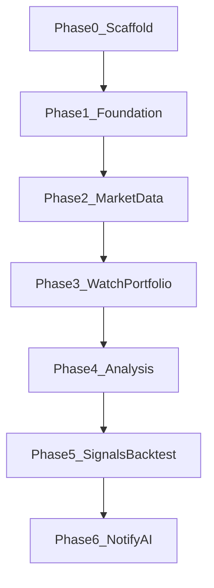

# 開発ロードマップ

market-platform の段階的な実装計画です。自動売買は対象外です。

## Phase 0 — Scaffold（完了）

モノレポの骨格を用意し、ローカルでヘルスチェックまで確認できる状態にした。

- `apps/web` / `apps/api` / `apps/analysis` の雛形
- `packages/database` / `shared-types` / `shared-config`
- pnpm Workspace + Turborepo
- Prisma 7 初期セットアップ（空 schema + baseline migration）
- Docker Compose 定義（postgres / api / web / analysis）
- 単体テスト（カバレッジ 100%）… `pnpm test`（各パッケージで statements/branches/functions/lines 100%、analysis は pytest-cov）

## Phase 1 — Foundation

共通基盤を固める。

- 認証（方針確定後に実装）
- 共通エラー形式
- ヘルスチェック
- ロギング
- OpenAPI（NestJS ↔ FastAPI）の契約整備
- 単体テスト（カバレッジ 100%）

## Phase 2 — Market Data

市場データの取得と永続化。

- 銘柄マスタ
- 価格取得ジョブ（api がオーケストレーション）
- 保存スキーマ（Prisma）
- 単体テスト（カバレッジ 100%）

## Phase 3 — Watchlist / Portfolio

ユーザー向けの基本ドメイン機能。

- ウォッチリスト CRUD
- ポートフォリオ管理・集計 API
- web UI
- 単体テスト（カバレッジ 100%）

## Phase 4 — Technical Analysis

分析 API の本格利用開始。

- `apps/analysis` でのテクニカル指標計算
- NestJS 経由での結果返却
- 単体テスト（カバレッジ 100%）

## Phase 5 — Signals / Backtest

- 売買シグナル定義・算出
- バックテスト実行と結果保存
- 単体テスト（カバレッジ 100%）

## Phase 6 — Notification / AI

- 通知チャネル
- AI 分析エンドポイント（`apps/analysis`）
- 単体テスト（カバレッジ 100%）

## 対象外

- 自動売買（注文執行・ブローカー連携など）

## 関連ドキュメント

- [ドキュメント索引](README.md)
- [アーキテクチャ概要](architecture/overview.md)
