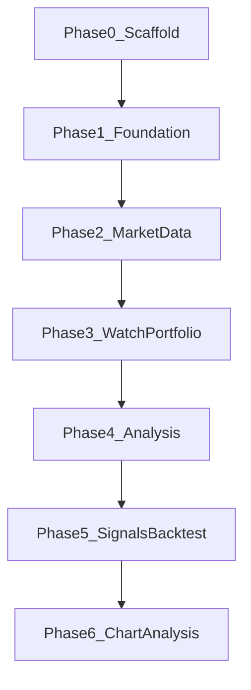

# 開発ロードマップ（v0.1.0）

market-platform の段階的な実装計画です。自動売買は対象外です。

## 共通品質要件（全 Phase）

各 Phase の実装では、次を満たすこと。

- **可読性のためのコメント**: モジュール・公開 API・分岐・外部 I/O・非自明な意図を日本語で厚めに記載する（「何をしているか」「なぜそうしているか」が後続の読者に伝わること）
- **単体テスト（カバレッジ 100%）**: statements / branches / functions / lines（analysis は pytest-cov）

## Phase 0 — Scaffold（完了）

モノレポの骨格を用意し、ローカルでヘルスチェックまで確認できる状態にした。

- `apps/web` / `apps/api` / `apps/analysis` の雛形
- `packages/database` / `shared-types` / `shared-config`
- pnpm Workspace + Turborepo
- Prisma 7 初期セットアップ（空 schema + baseline migration）
- Docker Compose 定義（postgres / api / web / analysis）
- 可読性のためのコメント（アプリ・共有パッケージのソースに厚めに記載）
- 単体テスト（カバレッジ 100%）… `pnpm test`

## Phase 1 — Foundation（完了）

共通基盤を固める。

- 認証（JWT + メール/パスワード。詳細は [ADR 001](../../../adr/001-authentication-jwt.md)）
- 共通エラー形式（`ApiErrorBody`）
- ヘルスチェック（OpenAPI 化・uptime 付与）
- ロギング（Nest / FastAPI のリクエストログ）
- OpenAPI（NestJS `/docs` ↔ FastAPI `/docs`）の契約整備
- CI（`.github/workflows/ci.yml`）
- 可読性のためのコメント
- 単体テスト（カバレッジ 100%）

## Phase 2 — Market Data（完了）

市場データの取得と永続化。

- 銘柄マスタ
- 価格取得ジョブ（api がオーケストレーション）
- 保存スキーマ（Prisma）
- 可読性のためのコメント
- 単体テスト（カバレッジ 100%）
- 詳細は [ADR 002](../../../adr/002-market-data-provider.md)

## Phase 3 — Watchlist / Portfolio（完了）

ユーザー向けの基本ドメイン機能。

- ウォッチリスト CRUD
- ポートフォリオ管理・集計 API
- web UI
- 可読性のためのコメント
- 単体テスト（カバレッジ 100%）
- 詳細は [ADR 003](../../../adr/003-watchlist-portfolio.md)

## Phase 4 — Technical Analysis（完了）

分析 API の本格利用開始。

- `apps/analysis` でのテクニカル指標計算（SMA / EMA / RSI / MACD）
- NestJS 経由での結果返却（`GET /symbols/:id/indicators`）
- 可読性のためのコメント
- 単体テスト（カバレッジ 100%）
- 詳細は [ADR 004](../../../adr/004-technical-analysis.md)

## Phase 5 — Signals / Backtest（完了）

売買シグナルとバックテストを API / analysis / Web で使える状態にした。

- 売買シグナル定義・算出
- バックテスト実行と結果保存
- Web: 銘柄選択に連動した価格チャート
- 可読性のためのコメント
- 単体テスト（カバレッジ 100%）

## Phase 6 — Chart Analysis（完了）

銘柄を指定した分析画面を充実させ、チャートとテクニカル指標を一体で確認できるようにした。

- Web: 銘柄選択 UI（ウォッチリスト / 検索から指定）
- ローソク足チャート（OHLC）表示
- Phase 4 のテクニカル指標（SMA / EMA / RSI / MACD など）をチャート上またはサブパネルで重ねて表示
- 出来高（Volume）の表示（価格チャート連動のサブチャート。データが揃う範囲で対応）
- 期間切替（日足 / 週足など）やズーム・パンなど、分析操作の基本 UX
- prices / indicators API に `interval=1d|1w`（週足は日足から集約）
- 可読性のためのコメント
- 単体テスト（カバレッジ 100%）
- 詳細は [ADR 005](../../../adr/005-chart-analysis.md)

## 対象外

- 自動売買（注文執行・ブローカー連携など）

## 関連ドキュメント

- [ドキュメント索引](../../../README.md)
- [アーキテクチャ概要](../../../architecture/overview.md)
- [v0.1 系列索引](README.md)
