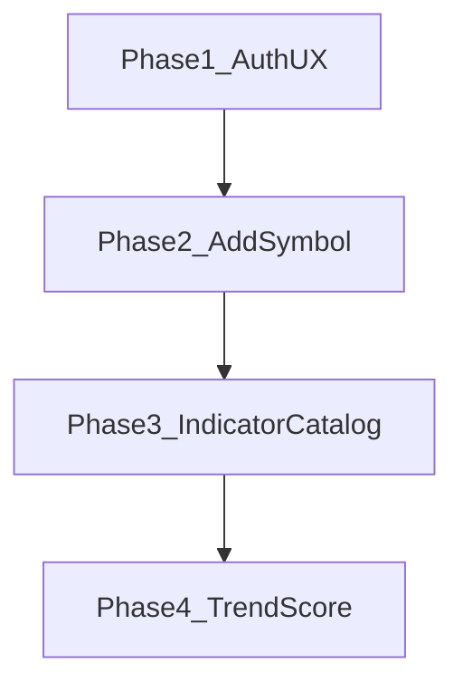

# 開発ロードマップ（v0.2.0）

v0.1.0 で揃えた機能を、製品としての画面導線に整える版です。自動売買は対象外です。

## 共通品質要件（全 Phase）

各 Phase の実装では、次を満たすこと。

- **可読性のためのコメント**: モジュール・公開 API・分岐・外部 I/O・非自明な意図を日本語で厚めに記載する（「何をしているか」「なぜそうしているか」が後続の読者に伝わること）
- **単体テスト（カバレッジ 100%）**: statements / branches / functions / lines（analysis は pytest-cov）

## Phase 1 — Auth UX（完了）

認証方式は [ADR 001](../../../adr/001-authentication-jwt.md) の JWT + メール/パスワードのまま。Web の画面導線だけを整える。

- 未ログイン時は `/login` または `/register` 以外を `/login` へ誘導する（トップ `/` を含む）
- ログイン／登録へのリンクは認証画面同士の相互リンクのみ。ヘッダーや機能画面には出さない
- ログイン済みで認証画面を開いた場合は `/` へ戻す
- ログイン／登録成功後は `/` へ進む
- 共通ヘッダーに機能メニューとログアウトを置く（ログアウトはヘッダーからのみ）
- 可読性のためのコメント
- 単体テスト（カバレッジ 100%）

対象 Issue: [GitHub #10](https://github.com/KenichiroArai/market-platform/issues/10)

## Phase 2 — 銘柄追加（完了）

指定した銘柄をマスタへ登録し、日足は保存済み期間の外側だけ取得する。

- Web `/symbols` からティッカー + 市場（US/JP）で銘柄を追加できる
- 名称・通貨・取引所は `MarketDataProvider.fetchQuote`（Yahoo / Stub）で補完する
- 日足は `DailyPrice` の最小日より前・最大日より後だけプロバイダへ問い合わせる（min〜max は再取得しない）
- 差分取得は銘柄追加時、cron / 手動同期、期間付きの価格・指標読み取りで動かす
- 可読性のためのコメント
- 単体テスト（カバレッジ 100%）
- 詳細は [ADR 002](../../../adr/002-market-data-provider.md)

対象 Issue: [GitHub #11](https://github.com/KenichiroArai/market-platform/issues/11)

## Phase 3 — テクニカル指標カタログ（完了）

チャート分析に分類付きのテクニカル指標を追加し、説明とおすすめ構成で選べるようにする。

- 分類: トレンド / モメンタム / オシレーター / ボラティリティ / 出来高 / サイクル
- 数式指標（MA・EMA・MACD・一目・PSAR・モメンタム・ROC・RSI・CCI・ストキャスティクス・Williams %R・サイコロジカル・ボリンジャー・ATR・標準偏差・ケルトナー・OBV・VWAP・MFI）を計算・描画する
- フィボナッチ水平線と Volume Profile を表示期間から算出する
- エリオット波動は説明のみ（自動認識は対象外）
- `/charts` はチャートを本画面に全幅表示。指標はモードレスまたは別ウィンドウ。拡大は全画面の別ウィンドウ。初期 ON は SMA 25/75/200・MACD・RSI・ボリンジャー・OBV・一目
- 可読性のためのコメント
- 単体テスト（カバレッジ 100%）
- 詳細は [ADR 006](../../../adr/006-indicator-catalog.md)

対象 Issue: [GitHub #12](https://github.com/KenichiroArai/market-platform/issues/12)

## Phase 4 — チャートにトレンドを示す

分類付き指標を 1 グループに固定して採点し、総合スコアをチャート背景色で示す。

- スコア用グループは指標あたり 1 つ（MACD / 一目 / RSI / CCI の二重計上をしない）。カタログ UI の複数分類表示は残す
- 各指標を -100〜+100 で採点し、トレンド ±40 / モメンタム ±20 / 他グループ ±10 で総合 ±100 にする
- 計算はチャートトグルと独立した正本セット。エリオットは採点しない
- `/charts` の価格ペイン背景を日足ごとの総合スコアで塗り、直近スコアと状態ラベルを表示する
- 可読性のためのコメント
- 単体テスト（カバレッジ 100%）
- 詳細は [ADR 007](../../../adr/007-trend-score.md)

対象 Issue: [GitHub #13](https://github.com/KenichiroArai/market-platform/issues/13)

## 後続 Phase

未定。必要になった時点で本ファイルへ追加する。

## 対象外

- 自動売買（注文執行・ブローカー連携など）
- httpOnly Cookie への移行、リフレッシュトークン（ADR 001 の将来検討のまま）

## 関連ドキュメント

- [ドキュメント索引](../../../README.md)
- [アーキテクチャ概要](../../../architecture/overview.md)
- [v0.2 系列索引](README.md)
- [ADR 001: JWT 認証](../../../adr/001-authentication-jwt.md)
- [ADR 002: 市場データプロバイダ](../../../adr/002-market-data-provider.md)
- [ADR 004: テクニカル分析](../../../adr/004-technical-analysis.md)
- [ADR 005: チャート分析](../../../adr/005-chart-analysis.md)
- [ADR 006: テクニカル指標カタログ](../../../adr/006-indicator-catalog.md)
- [ADR 007: トレンドスコア](../../../adr/007-trend-score.md)
