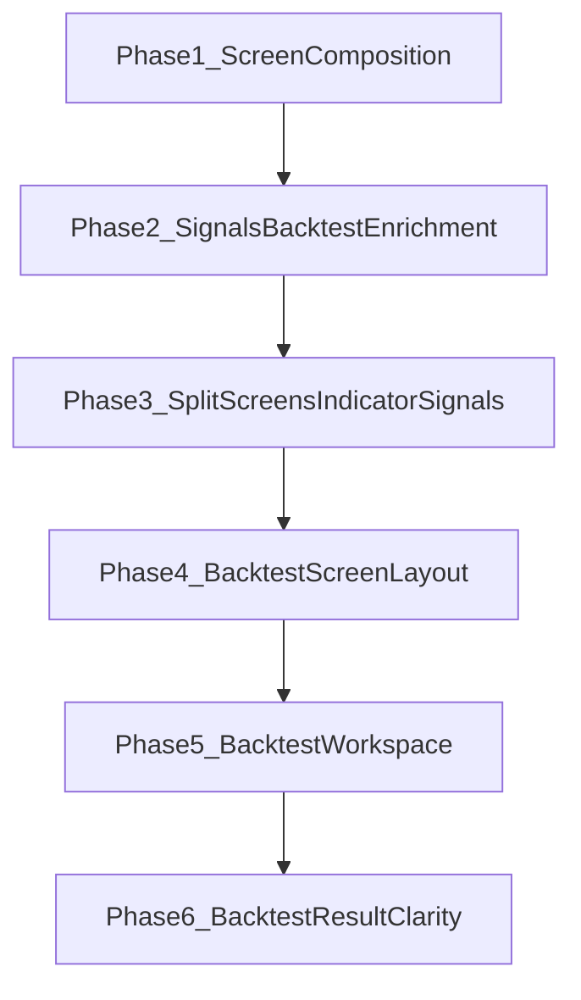

# 開発ロードマップ（v0.3.0）

v0.2.0 までの機能を製品導線として整えつつ、シグナル / バックテストの検証 UX を最小強化する版です。自動売買は対象外です。

## 共通品質要件（全 Phase）

各 Phase の実装では、次を満たすこと。

- **可読性のためのコメント**: モジュール・公開 API・分岐・外部 I/O・非自明な意図を日本語で厚めに記載する
- **単体テスト（カバレッジ 100%）**: statements / branches / functions / lines（analysis は pytest-cov）

## Phase 1 — 全体の構成（完了）

各画面の役割説明・ナビ日本語化・画面間クエリ連携。

- 各画面上部に役割説明（リード文）
- ナビ・見出しを「シグナル / バックテスト」に統一
- `app-routes.ts` による銘柄・チャート連携、銘柄ゼロ時の導線
- 対象 Issue: [GitHub #20](https://github.com/KenichiroArai/market-platform/issues/20)

## Phase 2 — シグナル / バックテスト最小強化（完了）

v0.1 Phase 5 のコア（定義 CRUD・ロング限定エンジン・結果永続化）の上に、検証 UI と統計を足す。

- 開始資金を実行フォームで設定できる
- 売買ポイントを価格チャートへ表示（▲Buy・▼Sell）
- エクイティカーブ（戦略 + Buy & Hold）
- 結果サマリーカード（リターン・勝率・最大 DD など）
- Buy & Hold 比較（サマリー・チャート）
- 取引履歴テーブル
- 詳細統計（Sharpe・Profit Factor・最大 DD）
- シグナル作成 UI（戦略種別 + パラメータ）
- SMA Cross の short/long 総当たり最適化（結果は非永続）
- 詳細は [ADR 009](../../../adr/009-backtest-enrichment.md)
- 対象 Issue: [GitHub #21](https://github.com/KenichiroArai/market-platform/issues/21)

## Phase 3 — シグナル / バックテスト画面分離（完了）

指標設定をチャート分析に集約し、バックテストは実行専用にする。シグナル正本は IndicatorSet（カタログ ID）から導出する。

- `/charts`: テクニカル指標の唯一の設定場所（変更は即チャート反映）。シグナル導出プレビューとバックテスト導線
- `/backtests`: 指標セット選択・実行・結果・カタログ SMA ペア最適化のみ（戦略作成フォーム廃止）
- ナビ「シグナル / バックテスト」→「バックテスト」
- `resolveSignalRule`（SMA ちょうど 2 本 / MACD / RSI）を shared-types 正本に
- `BacktestRun` は `indicatorSetId` + 戦略スナップショット。`signalDefinitionId` は過去互換で nullable
- 詳細は [ADR 010](../../../adr/010-signal-from-indicator-set.md)
- 対象 Issue: [GitHub #22](https://github.com/KenichiroArai/market-platform/issues/22)

## Phase 4 — バックテスト画面構成の整備

縦長で見づらかった `/backtests` を、常時表示の概要帯とタブ構成に再編する。

- 概要帯で選択銘柄（ティッカー + 名称）と主要指標（リターン / 勝率 / 最大 DD / 取引数）を一画面で把握できる
- タブ: 実行 / チャート / 実行結果 / 結果サマリー / エクイティカーブ / 取引履歴
- 銘柄選択時にセレクト横へ名称を表示
- 実行成功後は結果サマリータブへ自動切替
- 対象 Issue: [GitHub #23](https://github.com/KenichiroArai/market-platform/issues/23)

## Phase 5 — バックテスト画面再配置と指標導線の明確化（完了）

条件／実行と結果を分け、結果は縦スクロールでまとめる。価格チャートはチャート分析と同じ `AnalysisChart` に統一する。

- タブ: 設定と実行 / 結果（2タブ）
- 結果タブ: 実行履歴セレクト + 「選択中の実行結果」ヘッダ + サマリー / エクイティ / AnalysisChart（売買マーカー） / 取引履歴
- SMA 最適化にホバー説明。指標編集は `/charts` 維持
- 拡大ウィンドウでもホバー時のクロスヘア●が出るようサイズ同期を修正
- 対象 Issue: [GitHub #24](https://github.com/KenichiroArai/market-platform/issues/24)

## Phase 6 — バックテスト結果の分かりやすさ

結果タブで「何の条件か」「なぜ買った／売ったか」を読めるようにする。

- 結果に実行条件パネル（戦略ラベル・指標セット名・資金・fee/slippage）
- 約定に `entryReason` / `exitReason`（Analysis 付与・nullable 永続化）。既存 Run は空欄可
- スコア判断（現状 RSI）では `entryScore` / `exitScore` も付与し、取引履歴に「ラベル（値）」で表示。クロス戦略はスコア空欄
- 取引履歴に買い判断／売り判断列（日本語）
- 結果チャート表示モード切替（既定: ローソク＋Buy/Sell / 切替で指標セット＋売買）
- 詳細は [ADR 011](../../../adr/011-backtest-result-clarity.md)
- 対象 Issue: [GitHub #25](https://github.com/KenichiroArai/market-platform/issues/25)

## トレンドスコアによるバックテスト売買

チャート分析と同系のトレンドスコアで閾値クロス売買できるようにする。

- `signalMode`: `trendScore`（UI 既定） / `indicatorSet`（従来の SMA/MACD/RSI）
- 戦略 `trendScoreThreshold`（既定閾値 37.5 / -42.5）。lookback 付きでチャートと揃える
- 約定理由 `score_cross_up` / `score_cross_down` + `entryScore` / `exitScore`
- 詳細は [ADR 012](../../../adr/012-trend-score-backtest.md)

## 後続 Phase

未定。必要になった時点で本ファイルへ追加する。
