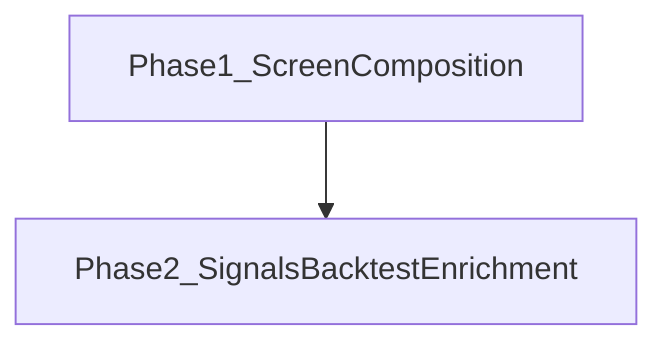

# 開発ロードマップ（v0.3.0）

v0.2.0 までの機能を製品導線として整えつつ、シグナル / バックテストの検証 UX を最小強化する版です。自動売買は対象外です。

## 共通品質要件（全 Phase）

各 Phase の実装では、次を満たすこと。

- **可読性のためのコメント**: モジュール・公開 API・分岐・外部 I/O・非自明な意図を日本語で厚めに記載する
- **単体テスト（カバレッジ 100%）**: statements / branches / functions / lines（analysis は pytest-cov）

## Phase 1 — 全体の構成（完了）

各画面の役割説明・ナビ日本語化・画面間クエリ連携。

- 各画面上部に役割説明（リード文）
- ナビ・見出しを「シグナル / バックテスト」に統一
- `app-routes.ts` による銘柄・チャート連携、銘柄ゼロ時の導線
- 対象 Issue: [GitHub #20](https://github.com/KenichiroArai/market-platform/issues/20)

## Phase 2 — シグナル / バックテスト最小強化

v0.1 Phase 5 のコア（定義 CRUD・ロング限定エンジン・結果永続化）の上に、検証 UI と統計を足す。

- 開始資金を実行フォームで設定できる
- 売買ポイントを価格チャートへ表示（▲Buy・▼Sell）
- エクイティカーブ（戦略 + Buy & Hold）
- 結果サマリーカード（リターン・勝率・最大 DD など）
- Buy & Hold 比較（サマリー・チャート）
- 取引履歴テーブル
- 詳細統計（Sharpe・Profit Factor・最大 DD）
- シグナル作成 UI（戦略種別 + パラメータ）
- SMA Cross の short/long 総当たり最適化（結果は非永続）
- 詳細は [ADR 009](../../../adr/009-backtest-enrichment.md)
- 対象 Issue: [GitHub #21](https://github.com/KenichiroArai/market-platform/issues/21)

## 後続 Phase

未定。必要になった時点で本ファイルへ追加する。
