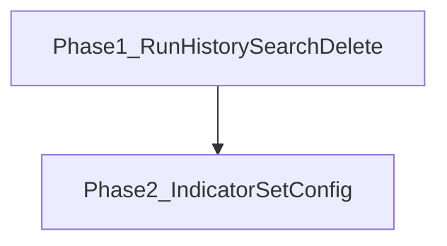

# 開発ロードマップ（v0.4.0）

実行履歴（`BacktestRun`）の操作性を高める版です。検索・論理削除・一覧/詳細の分離を行います。

## 共通品質要件（全 Phase）

各 Phase の実装では、次を満たすこと。

- **可読性のためのコメント**: モジュール・公開 API・分岐・外部 I/O・非自明な意図を日本語で厚めに記載する
- **単体テスト（カバレッジ 100%）**: statements / branches / functions / lines（analysis は pytest-cov）

## Phase 1 — 実行履歴の操作性向上

実行履歴を条件付けて検索し、論理削除できるようにする。

- `BacktestRun.isActive`（論理削除。`false` で一覧デフォルトから除外）
- `GET /backtests` — 条件付き一覧（軽量 DTO。trades / equityPoints 不含）
- `GET /backtests/:id` — 詳細（従来どおり trades / equityPoints 込み）
- `DELETE /backtests/:id` — 単一論理削除
- `DELETE /backtests` — 検索条件と同一クエリでの一括論理削除（`{ deletedCount }`）
- 検索条件: 銘柄 / 戦略 / 指標セット / 検証期間 / 実行日時 / 削除済みを含む（`isActive=all`）
- デフォルト: 活動中のみ（`isActive=true`）
- UI: `/backtests` 結果タブの「検索…」→ `ModelessWindow` パネル
- 削除: 行ごと / 検索結果一括 / 活動中すべて
- 詳細は [ADR 013](../../../adr/013-backtest-run-history-management.md)
- 対象 Issue: [GitHub #27](https://github.com/KenichiroArai/market-platform/issues/27)

## Phase 2 — テクニカル指標の細かい設定

指標セットにパラメータ上書き・スコア配点・買い売り閾値を持たせ、保存・上書き・複製を可能にする。

- `IndicatorSet` に `indicatorParams` / `groupWeights` / `buyThreshold` / `sellThreshold` を追加
- `PATCH /indicator-sets/:id` — 上書き更新
- `POST /indicator-sets` — 新フィールド対応（同名は 409、クライアントが確認後 PATCH）
- `GET /symbols/:id/indicators` — オプション `indicatorParams`（JSON）
- `GET /symbols/:id/trend-score` — オプション `groupWeights`（JSON）
- グループ配点は合計 100% 必須（不一致は登録不可）
- UI: `/charts` 指標設定でパラメータ・配点・閾値を編集
- UI: セット呼び出しに複製ボタン（指標設定へ遷移、元名をセット名欄に表示）
- UI: 同名保存時に上書き確認ダイアログ
- バックテスト `trendScore` モードはセット保存済み閾値をデフォルト使用
- 詳細は [ADR 014](../../../adr/014-indicator-set-config.md)
- 対象 Issue: [GitHub #28](https://github.com/KenichiroArai/market-platform/issues/28)

## 後続 Phase

未定。必要になった時点で本ファイルへ追加する。
