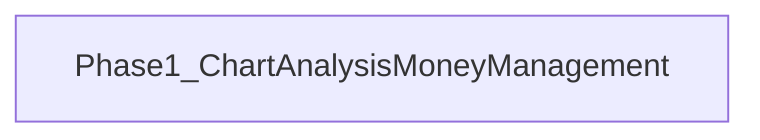

# 開発ロードマップ（v0.5.0）

チャート分析に資金管理とエントリー助言を統合する版です。

## 共通品質要件（全 Phase）

各 Phase の実装では、次を満たすこと。

- **可読性のためのコメント**: モジュール・公開 API・分岐・外部 I/O・非自明な意図を日本語で厚めに記載する
- **単体テスト（カバレッジ 100%）**: statements / branches / functions / lines（analysis は pytest-cov）

## Phase 1 — チャート分析 × マネーマネージメント

チャート分析に資金管理を導入し、基準日時点のエントリー判定・予測・ストップ／ピラミッド水準を提示する（Issue #32）。

- Analysis `entry_advice.py` + `POST /analysis/entry-advice`
- Nest `GET /symbols/:symbolId/entry-advice`
- shared-types `EntryAdviceDto`
- UI: `/charts` に MM 設定パネル・エントリー助言パネル・チャート価格線
- シグナル: 指標導出ルール、未確定時はトレンドスコア閾値フォールバック
- 詳細は [ADR 017](../../../adr/017-chart-analysis-money-management.md)
- 対象 Issue: [GitHub #32](https://github.com/KenichiroArai/market-platform/issues/32)
