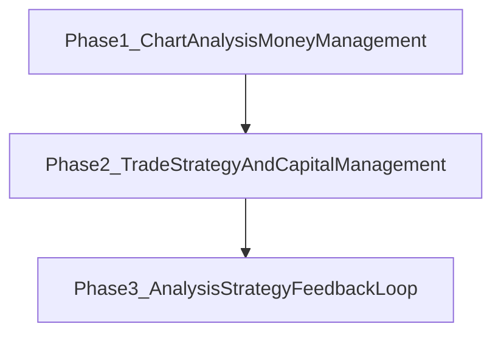

# 開発ロードマップ（v0.5.0）

チャート分析への資金管理統合と、売買戦略・トレードプランによる一貫支援を行う版です。
Phase 3 でバックテスト結果からルールベースのコース補正（次アクション）までつなぐ。

## 共通品質要件（全 Phase）

各 Phase の実装では、次を満たすこと。

- **可読性のためのコメント**: モジュール・公開 API・分岐・外部 I/O・非自明な意図を日本語で厚めに記載する
- **単体テスト（カバレッジ 100%）**: statements / branches / functions / lines（analysis は pytest-cov）

## Phase 1 — チャート分析 × マネーマネージメント

チャート分析に資金管理を導入し、基準日時点のエントリー判定・予測・ストップ／ピラミッド水準を提示する（Issue #32）。

- Analysis `entry_advice.py` + `POST /analysis/entry-advice`
- Nest `GET /symbols/:symbolId/entry-advice`
- shared-types `EntryAdviceDto`
- UI: `/charts` に MM 設定パネル・エントリー助言パネル・チャート価格線
- シグナル: 指標導出ルール、未確定時はトレンドスコア閾値フォールバック
- 詳細は [ADR 017](../../../adr/017-chart-analysis-money-management.md)
- 対象 Issue: [GitHub #32](https://github.com/KenichiroArai/market-platform/issues/32)

## Phase 2 — 売買戦略・資金管理（トレードプラン）

分析結果から売買判定・損切／利確・ポジションサイズ・リスク評価までを一貫したトレードプランとして提示する（Issue #33）。

- Analysis `strategy/*` + `POST /analysis/trade-plan`
- Nest `GET /symbols/:symbolId/trade-plan`
- shared-types `TradePlanDto`
- 不足指標: Donchian / ADX（カタログ連動）
- UI: メニュー再編（分析ハブ・戦略）、`/strategy` トレードプラン一画面
- バックテスト: `exitPolicy` で Strategy の損切／利確ロジックを共有（既定は現状互換）
- 詳細は [ADR 018](../../../adr/018-trade-strategy-plan.md)
- 対象 Issue: [GitHub #33](https://github.com/KenichiroArai/market-platform/issues/33)

## Phase 3 — 分析と戦略をまとめる（コース補正ループ）

バックテスト結果をルールベースで読み取り、再実行プリセットと戦略／チャート導線で次の一手につなげる（Issue #35）。

- `BacktestRun.exitPolicyJson` 永続化（履歴復元・条件表示）
- Web `backtest-insights` 純関数 + shared-types（インサイトは非永続・都度導出）
- UI: 結果タブ「結果の読み取り」パネル（所見・根拠・次アクション）
- アクション: `apply_run_preset` / `open_strategy` / `open_charts`
- ディープリンク: `strategyHref`、戦略画面のクエリ初期化、分析ハブの検証→見直し枠
- AI 理由生成はスコープ外
- 詳細は [ADR 019](../../../adr/019-analysis-strategy-feedback-loop.md)
- 対象 Issue: [GitHub #35](https://github.com/KenichiroArai/market-platform/issues/35)
